# PropertyVault Technical Analysis & Development Plan

## 1. ER Diagram (Entity-Relationship)

```mermaid
erDiagram
    STATE ||--|{ COUNTY : contains
    COUNTY ||--|{ CITY : contains
    CITY ||--|{ PROPERTY : contains
    
    SUBSCRIPTION_PLAN ||--|{ USER_SUBSCRIPTION : defines
    USER ||--|{ USER_SUBSCRIPTION : has
    USER ||--|{ PROPERTY : owns
    USER ||--|{ COMMUNITY_POST : authors
    
    PROPERTY ||--|{ PROPERTY_IMAGE : has
    PROPERTY ||--|{ AI_VALUATION : has

    STATE {
        uuid id PK
        string name
        string code "Unique (e.g. CA)"
    }
    COUNTY {
        uuid id PK
        uuid state_id FK
        string name
        string code "Unique within State"
        int last_sequence_number "For Tag Generation"
    }
    PROPERTY {
        uuid id PK
        string property_tag "Unique [ST-CO-SEQ-EXT]"
        string external_property_id
        enum type
        uuid owner_id FK
        uuid city_id FK
        decimal latitude
        decimal longitude
        jsonb ai_metadata "Risk, Valuation, etc."
    }
```

## 2. Backend Implementation Strategy

**Recommendation:** **REST API** using **Node.js (NestJS)** with **PostgreSQL**.

*   **Justification:** While GraphQL is flexible, the strict hierarchical nature of Real Estate (State -> County -> City) and the need for rigorous caching of static geolocation data make REST highly efficient. NestJS provides structure for the complex business logic (Tag Generation).

**Key Endpoints:**
*   `POST /properties`: Triggers the **Tag Generation Service**.
    *   *Logic:* Locks the County row, increments `last_sequence_number`, generates tag, releases lock.
*   `GET /properties?tag={tag}`: Fast lookup by unique ID.
*   `POST /ai/valuation`: Async job queue (BullMQ) to process property data against external valuation APIs.

## 3. Scalability & Security

*   **Authentication:** Use **Auth0** or **Supabase Auth** (JWT). Decouple auth from core logic.
*   **Tag Immutability:** Enforced via Database Triggers (`BEFORE UPDATE` trigger raising exception if `property_tag` changes).
*   **Scale:** 
    *   **Read Replicas:** For the public-facing ecosystem/ads.
    *   **Sharding:** Future-proof by sharding `Properties` table by `State` if US-wide adoption hits millions.
*   **AI Integration:**
    *   Store property descriptions as **Vector Embeddings** (using `pgvector`) to allow semantic search (e.g., "Find houses near water with renovation potential").

## 4. Estimation (Team of 3-5)

*   **Phase 1 (MVP - Core Storage & Tag):** 4 Weeks.
*   **Phase 2 (SaaS/Billing & Auth):** 3 Weeks.
*   **Phase 3 (AI & Ecosystem):** 5 Weeks.
*   **Total:** ~3 Months to Beta.
